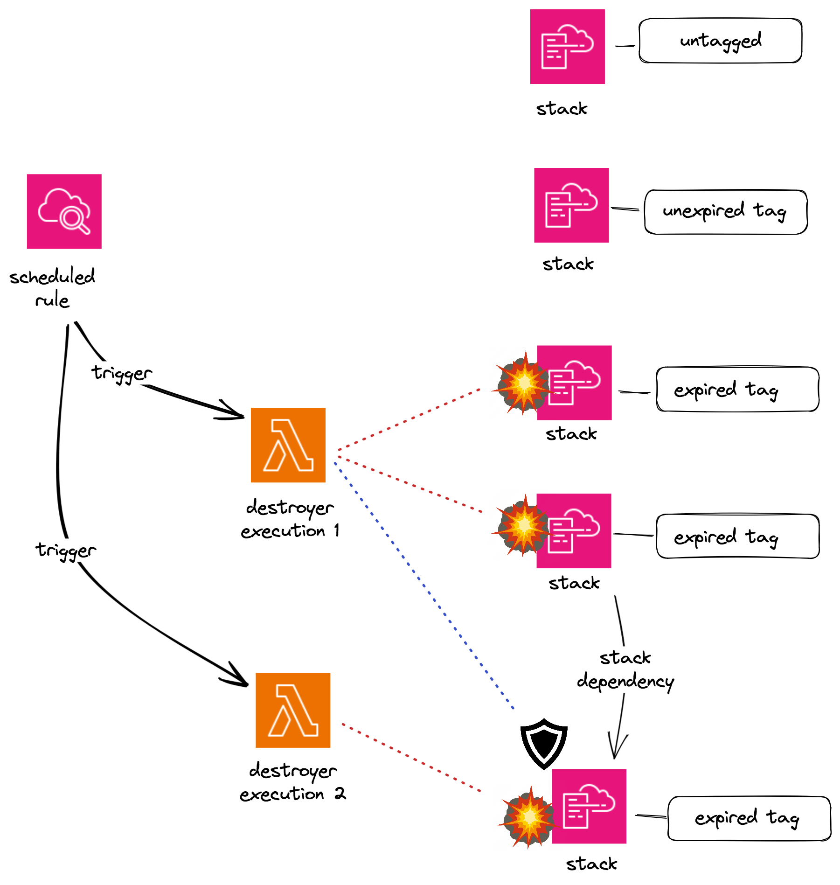

# CloudFormation Stack Destroyer

## Introduction
This project was brought into existence based on experience of CI pipelines deploying cloudformation stacks for testing purposes.  This is not meant for production accounts but test-only accounts.

Deploying stacks for AWS system testing takes time.  Undeploying stacks can take just as long or longer.  Additionally, having stacks deployed can cost additional money if your test accounts if they include provisioned resources such as EC2, ECS, RDS etc.

The solution provided here is to deploy a lightweight lambda that executes on a semi regular schedule that searches and destroys test stacks that have passed their retention period or expiration.  This delivers the following benefits:
* halves pipeline deployment times
* means repeat deployments are faster
* Pipelines are simplified
* Developers can manually test semi persistent resources
* Costs of deployed resources are minimised
* Reduces worry of accounts becoming cluttered
* Improves deployment replayability / confidence with CI

## Usage

In order to use this tool, the following needs to be done:

* Ensure cdk has been set up on your aws account enabling cdk deployments
* Configure and deploy the stack-destroyer to your test account. Don't worry. Stacks need to be tagged in order to be considered for deletion
* Start tagging cloudformation stacks you deploy with either a retention tag or an expiry tag


## Deploying

After downloading the source you will need to ensure the following build dependencies are installed and available on the PATH.

* Python
* Poetry
* Make
* AWS CLI
* AWS CDK

### Destroyer Configuration

Create a .env file like the following example with account / region information.
```bash
echo "export CDK_DEPLOY_ACCOUNT=##########
export CDK_DEFAULT_REGION=##########
export DESTROYER_ASSUMED_ROLE=arn:aws:iam::${CDK_DEPLOY_ACCOUNT}:role/rol_cloudformation_stack_destroyer_control
export STACK_RETENTION_TAG=STACK_RETENTION
export STACK_EXPIRY_TAG=STACK_EXPIRY
export DESTROYER_SCHEDULE=0,15,30,45 18,19 * * *
" > .env
```

### deploy

```bash
make deploy_test
```

## Tag stacks

```python
from stack import TestStack
import aws_cdk as cdk
from datetime import datetime, timedelta

test_stack = TestStack(
    app,
    "TestStack",
    env=cdk.Environment(account=account, region=region),
)

# Can choose between tagging conventions. Note that tagging generally will cascade onto resources so when inspecting resources you'll be able to see these tags as well.

# Retention specifies a number of millis to after the LastUpdateTime of the stack
test_stack.tags.set_tag("STACK_RETENTION", str(cdk.Duration.hours(3).to_milliseconds()))

# Expiry specifies a specific timestamp in iso format when the stack should be deleted.
test_stack.tags.set_tag("STACK_EXPIRY", (datetime.now() + timedelta(hours=3)).isoformat()
)
```

## Stack dependencies

There can be problems in ordering when you issue a delete of a stack that is depended upon by another stack.  Rather than try to analyse the dependency hierarchy per stack, the approach taken was to repeat execution of the destroyer until dependent stacks have been removed.



